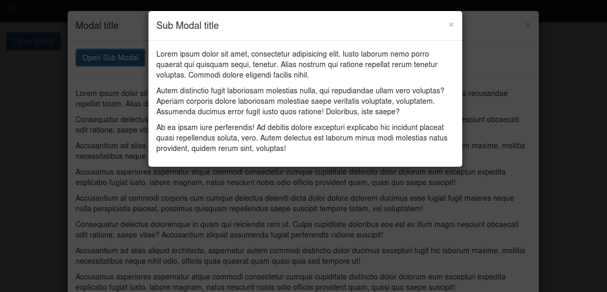

# React Modal Bootstrap

Modal component for React with bootstrap style.

[](http://minhtranite.github.io/react-modal-bootstrap)

## Installation

### NPM

```bash
npm install --save react-modal-bootstrap
```

### Bower
```bash
bower install --save react-modal-bootstrap
```

## Usage

### Dependencies

**Webpack:**

```js
require('path/to/bootstrap.css');
```

**Without Webpack:**

```html
<link rel="stylesheet" type="text/css" href="path/to/bootstrap.css">
```

### JS

```js
import {
  Modal,
  ModalHeader,
  ModalTitle,
  ModalClose,
  ModalBody,
  ModalFooter
} from 'react-modal-bootstrap';
...
state = {
  isOpen: false
};

openModal = () => {
  this.setState({
    isOpen: true
  });
};

hideModal = () => {
  this.setState({
    isOpen: false
  });
};
...
<Modal isOpen={this.state.isOpen} onRequestHide={this.hideModal}>
  <ModalHeader>
    <ModalClose onClick={this.hideModal}/>
    <ModalTitle>Modal title</ModalTitle>
  </ModalHeader>
  <ModalBody>
    <p>Ab ea ipsam iure perferendis! Ad debitis dolore excepturi
      explicabo hic incidunt placeat quasi repellendus soluta,
      vero. Autem delectus est laborum minus modi molestias
      natus provident, quidem rerum sint, voluptas!</p>
  </ModalBody>
  <ModalFooter>
    <button className='btn btn-default' onClick={this.hideModal}>
      Close
    </button>
    <button className='btn btn-primary'>
      Save changes
    </button>
  </ModalFooter>
</Modal>
```

### Styles

**Default:**

```js
backdropStyles = {
  base: {
    background: 'rgba(0, 0, 0, .7)',
    opacity: 0,
    visibility: 'hidden',
    transition: 'all 0.4s',
    overflowX: 'hidden',
    overflowY: 'auto'
  },
  open: {
    opacity: 1,
    visibility: 'visible'
  }
};

dialogStyles = {
  base: {
    top: -600,
    transition: 'top 0.4s'
  },
  open: {
    top: 0
  }
}
```

**Custom:**

You can set custom styles vie `backDropStyles`, `dialogStyles` prop.

### UMD

```html
<link rel="stylesheet" type="text/css" href="path/to/bootstrap.css">
<script src="path/to/react-modal-bootstrap/dist/react-modal-bootstrap.js"></script>
```

```js
...
var Modal = window.ReactModalBootstrap.Modal;
var ModalHeader = window.ReactModalBootstrap.ModalHeader;
var ModalTitle = window.ReactModalBootstrap.ModalTitle;
var ModalClose = window.ReactModalBootstrap.ModalClose;
var ModalBody = window.ReactModalBootstrap.ModalBody;
var ModalFooter = window.ReactModalBootstrap.ModalFooter;
...
```

Example [here](http://codepen.io/vn38minhtran/pen/yYqXpP)

## Props
| Name | Type | Default | Description |
|------|------|---------|-------------|
| isOpen | bool   | false |             |
| backdrop | bool | true | Close when click on backdrop |
| keyboard | bool | true | Close when press ESC |
| size | string | '' | 'modal-lg' or 'modal-sm' |
| onRequestHide | function | function(){}| Callback when modal request hide |
| backdropStyles | object | {} | Styles object ([Radium](https://github.com/FormidableLabs/radium)) |
| dialogStyles | object | {} | Styles object ([Radium](https://github.com/FormidableLabs/radium)) |

## Example
View [demo](http://minhtranite.github.io/react-modal-bootstrap) or example folder.
